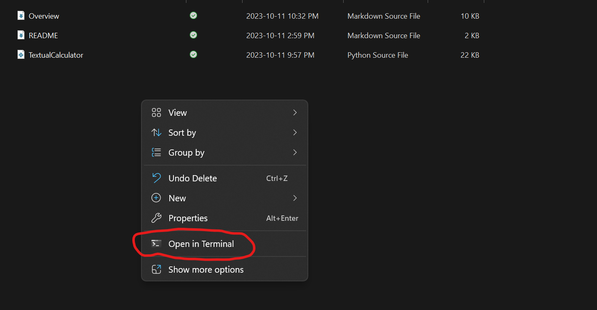

[](https://classroom.github.com/a/oB7VDeFN)
# ExplorationActivity1: Textual Calculator
## Table of Contents
1. [Which Package/Library](#which-package/library)
2. [How To Run The Program](#how-to-run-the-program)
3. [What Is The Purpose](#what-is-the-purpose)
4. [Some Sample Input/Output](#some-sample-input/output)
***
### Which Package/Library
For the first exploration activity, I decided to use python's regular expression as my library of choice. It also has numpy but it is only used to supply the math functions.
***
### How To Run The Program
The program is pretty easy to run:
1. Simply navigate to the folder where the TextualCalculator.py is.
2. Right click on the empty space, and select the 'open in terminal' option.

3. If that isn't an option copy the path of the folder and open the terminal and use: ```cd <PATH>```
4. Then use: ```python TextualCalculator.py``` 

This will start the program.
***
### What Is The Purpose
The purpose of this program is that it is an easily expandable text interpreter that evaluates equations, conditionals, and comparisons. With some additions it may replace the default calculator given to you by your os.
***
### Some Sample Input/Output
```
PS <PATH> python TextualCalculator.py
Please input a question/cmd below:
What is 2^4 % 7
ANSWER: 2.0
Please input a question/cmd below:
Is ans/2 > 111 % 3
ANSWER: Yes, ans/2 > 111 % 3 is true
Please input a question/cmd below:
Compare e and (ans+2)^2-13
ANSWER: e < (ans+2)^2-13
Please input a question/cmd below:
evaluate cos(pi/4)
ANSWER: 0.7071067811865476
Please input a question/cmd below:
Close
PS <PATH> ...